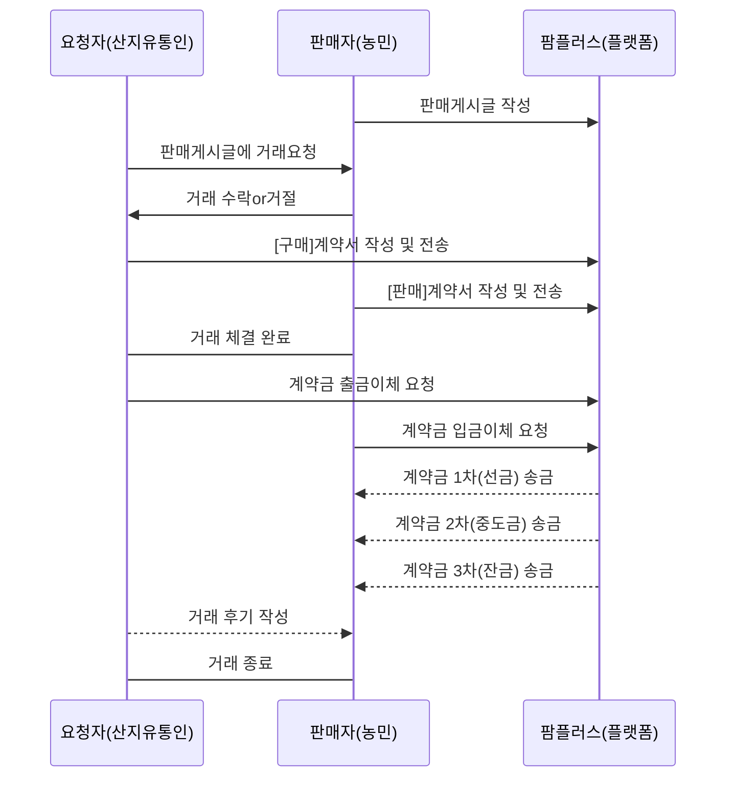

# 2020 NH 디지털혁신캠퍼스 챌린지 온라인 해커톤

### 선구안 팀 - 팜플러스(선도거래 안전간편결제 서비스)

> - 선도거래(일명 '밭떼기거래') 에서 계약서 미작성으로 인해 피해를 보는 농민들을 위한
>   매물(밭)거래부터 계약서 작성, 계약금 송금 기능을 지원하는 **선도거래 안전간편결제 서비스**

- 박찬영(팀장 / 기획,개발(서비스 프로세스, Front, API))
- 김성원(팀원 / 발표, 기획)
- 전병준(팀원 / 개발(Front))
- 홍정표(팀원 / 기획)
- 박지현(팀원 / 자료조사)

### 수상 - 장려상


### 개발 스택

- Front-End : React.js
- State : react-redux, redux-thunk
- Database :
  - 로컬 : json-server
  - 배포 : firebase realtime DB
- Storage : Firebase Storage
- API : [NH Developer Center API](https://developers.nonghyup.com/guide/GU_1000) (Fin-Account, Transfer, etc...)

### 서비스 주요기능

- 회원가입
  - NH API의 예금주조회, Fin-Account발급을 통해 계좌등록과 이체기능을 활성화하여 가입을 진행합니다.
- 판매 게시글 작성
  - react-redux를 통해 게시글의 정보를 저장하고 등록합니다.
  - [🔗 예시. 로그인 후, dispatch를 통한 사용자정보 state관리](https://github.com/Dolphin-PC/FarmPlus-NH_hackathon/blob/main/src/sample/login.ts)
  - [🔗 사용자, 게시글 등 reducers](https://github.com/Dolphin-PC/FarmPlus-NH_hackathon/tree/main/src/reducers)
- 게시글 필터링 및 상세 게시글내용 확인
  - 지역, 농지유형 등의 구분으로 필터링한 게시글을 표시하고, 게시글내용을 확인할 수 있습니다.
- 계약 요청 및 응답
  - 거래진행을 위해 상호간의 계약서작성을 요청합니다.
- 계약서 작성 및 계약금 송금
  - 계약서에는 매물의 정보와 계약위반사항, 계약금송금일정 등 내용이 포함되있습니다.
  - [계약금 송금 화면 Source](https://github.com/Dolphin-PC/FarmPlus-NH_hackathon/blob/main/src/components/dialogs/ContractDialog.tsx#L131)
  - [출금이체 API Source](https://github.com/Dolphin-PC/FarmPlus-NH_hackathon/blob/main/src/api/simplePayActions.ts#L12)
  - [입금이체 API Source](https://github.com/Dolphin-PC/FarmPlus-NH_hackathon/blob/main/src/api/simplePayActions.ts#L131)
- 계약서 저장 기능
  - 과거에 거래했던 계약서 내용을 언제든 찾아볼 수 있습니다.

### 결과물

- [시연영상](https://drive.google.com/file/d/1cjWEk6jL4fuFAf_NLi6j8E3E2TajTBAu/view?usp=sharing)
- [발표자료](https://dolphin-pc.github.io/FarmPlus-NH_hackathon/docs/FarmPlus_PPT_NH_hackathon.pdf)
- 호스팅 - https://nh-farmplus.firebaseapp.com
  - 로그인 계정정보 :
    - ID : seller / PW : 123
    - ID : pcy / PW : 123

### 거래 흐름도

- 실선 화살표 : 구현 기능
- 점선 화살표 : 미구현 기능



### 주요 고객

- 농민
- 산지유통인

### 경쟁력

- 계약서 작성을 필수로 하여, 위험이 없는 안전한 선도거래 실현
- 접근성 향상; 매물을 모바일 플랫폼에 직접 등록하여 농가와 산지유통인에 대한 접근성 향상 및 거래량 향상 기대

### 특징

- 저장성이 떨어지는 노지작물(무,배추 등)은 70~90%가 밭떼기거래를 통해 거래되는 상황
- 전체 밭떼기거래 중 57%가량이 표준계약서를 작성하지 않아, 법적 보호를 받지 못하는 상황
- 2013년 부터 과태료 부과 이력 전무, 표준계약서 작성 의무에 대한 법적 실효성 부재

### 기대효과

- 농민 측 : 농가의 소득 증대, 거래량 상승, \*거래파기 및 체불의 위험을 회피
- 산지유통인 측 : 방문없이 다양한 농가의 매물을 확인 가능하여, 접근성 향상, 비용 절감 효과

### 수익모델

- 총 매매대금의 1% 중개 수수료(예상 매출액 약 100억원)
- 노지작물 시장규모(2017~2018, 1조 4,400억원)

---

### 프로젝트 실행방법

```
1. yarn install
2. yarn start
```

### (2024.2 변경)

- firebase서비스 배포를 위해, 기존 DB를 json-server에서 firebase realtime DB로 변경
- typescript를 적용하여, 런타임 환경에서의 redux데이터 오류 해결
