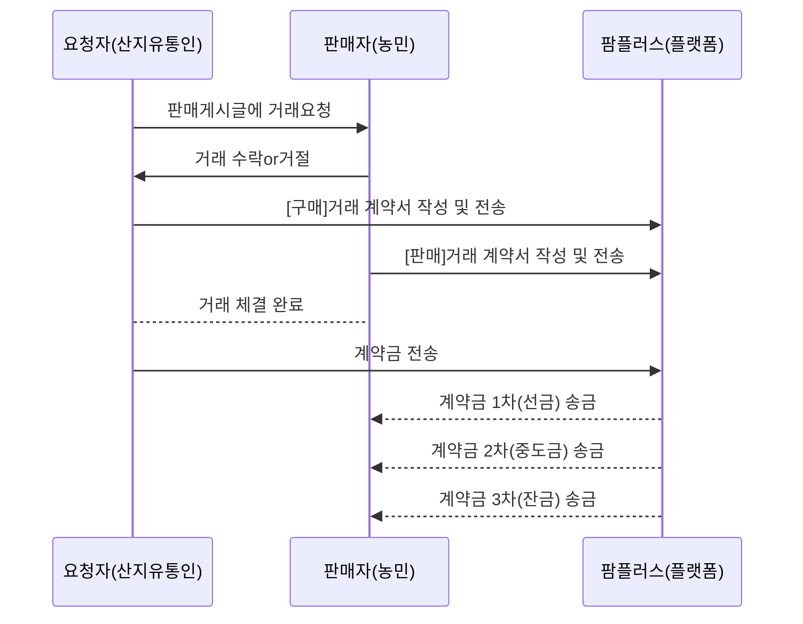

## 거래 흐름도

- 실선 화살표 : 구현 기능
- 점선 화살표 : 미구현 기능

```mermaid
sequenceDiagram

participant 가 as 요청자(산지유통인)
participant 나 as 판매자(농민)
participant 다 as 팜플러스(플랫폼)

가->>나: 판매게시글에 거래요청
나->>가: 거래 수락or거절

가->>다: [구매]거래 계약서 작성 및 전송
나->>다: [판매]거래 계약서 작성 및 전송
가-->나: 거래 체결 완료

가->>다: 계약금 전송

다-->>나: 계약금 1차(선금) 송금
다-->>나: 계약금 2차(중도금) 송금
다-->>나: 계약금 3차(잔금) 송금
```
